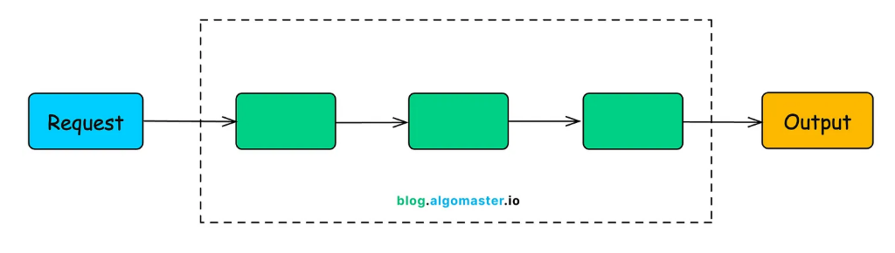
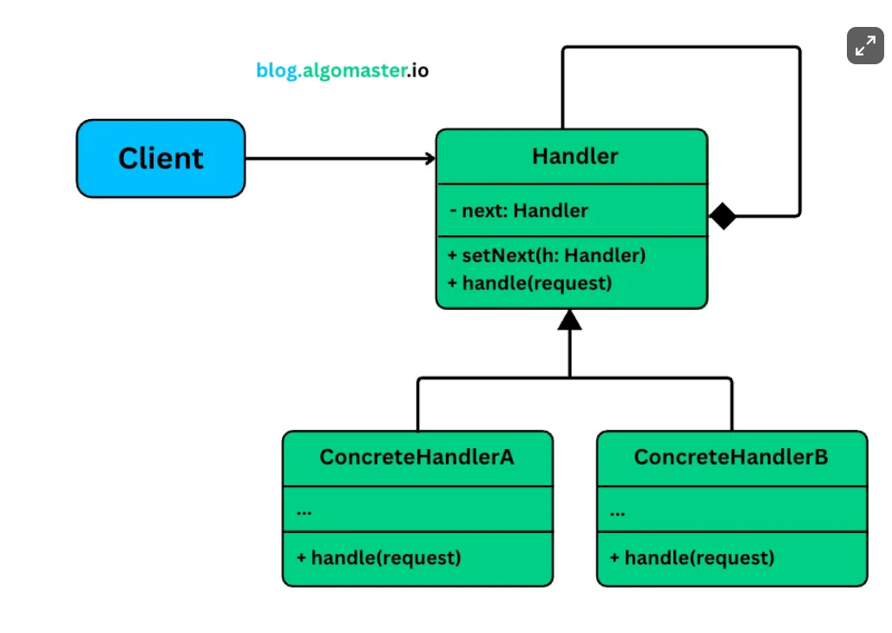

# Chain of responsibility

The Chain of Responsibility Design Pattern is a behavioral pattern that lets you pass requests along a chain of handlers, allowing each handler to decide whether to process the request or pass it to the next handler in the chain.

It’s particularly useful in situations where:

- A request must be handled by one of many possible handlers, and you don’t want the sender to be tightly coupled to any specific one.
- You want to decouple request logic from the code that processes it.
- You want to flexibly add, remove, or reorder handlers without changing the client code.

The Chain of Responsibility Pattern solves this by turning individual processing steps into standalone classes, each responsible for one specific concern. These handlers are linked together to form a chain, and the request flows through the chain until it is handled (or dropped).

The Chain of Responsibility Pattern allows a request to be passed along a chain of handlers.  
Each handler in the chain can either:
- Handle the request, or
- Pass it to the next handler in the chain

This pattern decouples the sender of the request from the receiver(s), giving you the flexibility to compose chains dynamically, reuse logic, and avoid long, rigid conditional blocks.

## Core Components
1. Handler Interface - Declares a method handle() to process the requests. Holds a reference to the next handler in the chain
2. Concrete Handlers - Implement the Handler interface. Each concrete handler will Handle the request (e.g., reject, log, transform), or Pass the request along to the next handler in the chain.
3. Client - Builds and connects the chain of handlers using setNext(). Sends the request to the first handler in the chain. Is unaware of which handler will ultimately process the request.

