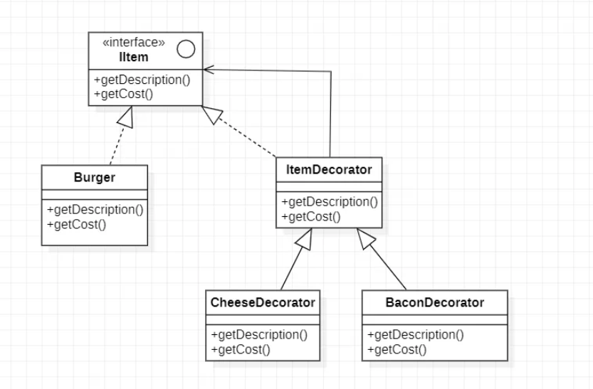

# Decorator Pattern

The decorator pattern allows you to **add new functionalities or responsibilities to an object dynamically**  
without altering its original structure  
Think of it as adding wrapping paper, ribbons or bows to a gift. The original gift remains intact but its appearance or even purpose (now it's a bday gift instead of a box) are enhanced by adding these decorations.

## Core problem it solves
- Avoid "Subclassing Hell" or "Class Explosion" - If you have a base class and want to extend its functionality by adding subclasses, you quickly run into a combinatorial explosion of subclasses.  
    -  If you have a Coffee and want to add Milk, Sugar, and Caramel, you'd need:
      - MilkCoffee, SugarCoffee, CaramelCoffee, MilkSugarCoffee, MilkCaramelCoffee, MilkSugarCaramelCoffee... and so on.
      - This would be an explosion of classes, and static functionality.
    - Subclassing adds behavior at compile time. What if you want to add an add-on dynamically at runtime?
    - The decorator pattern allows you to stack features like layers instead of creating a new class for every combination.
    - IBeverage beverage = new Ginger(new Sugar(new Tea(())));

## Core Idea
The decorator pattern suggests wrapping the original object( the "component") inside a series of wrapper objects (the "decorators")
Each decorator adds its own specific behavior before delegating the call to the wrapped object

The Decorator Pattern attaches additional responsibilities to an object dynamically using Composition.
Decorators provide a flexible alternative to subclassing for extending functionality.
We use inheritance to achieve type-matching, not to get behavior. ICondimentDecorator extends IBeverage.

Creates flexible design - Flexibility: You can combine multiple decorators in various ways, adding features dynamically at runtime.

## Key Components

1. Component (Abstract class or Interface) - Defines a common interface for both the concrete components and the decorators. 
    This ensures we can use decorators interchangeably with the concrete components.
     eg: IBeverage
2. Concrete Component - The actual base component that needs to be decorated. 
    The original object to which responsibilities will be added. 
    eg: Coffee, Tea
3. Decorator (Abstract class)
    - Maintains a reference to the component object.
    - Implements the Component interface.
    - Crucially, it delegates all its component responsibilities to the wrapped object.
    - eg: BeverageDecorator
4. Concrete Decorator 
    - Implement the Decorator class and adds specific responsibilities/functions.
    - They typically add their own behavior and then call the corresponding method on the wrapped object
    - eg: Sugar, Ginger

